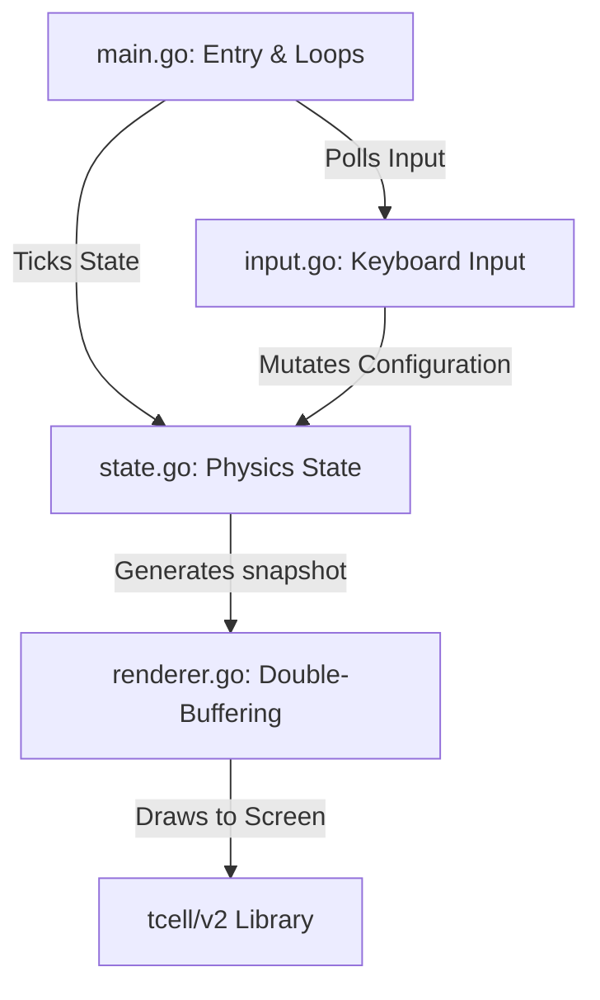

# 📖 voidmatrix — Complete A to Z Technical Documentation

`voidmatrix` is a high-performance, visually advanced, and feature-rich terminal Matrix digital rain simulator written in Go. It acts as a major visual and functional upgrade to classic utilities like `cmatrix` and `unimatrix`, introducing modern visual elements like 3D parallax depth layers, custom text decoders, ground splashes, wind effects, color blending gradients, and lag-free render loops.

---

## 🏗️ 1. High-Level Architecture

The project is structured into modular components that separate the **input handling**, **physics state updates**, and **rendering pipeline**:



### File Layout
*   [main.go](file:///home/austin/Documents/voidmatrix/main.go): The application entry point. Handles CLI flags, terminal initialization, the 5ms input polling loop, and the main animation clock tick.
*   [state.go](file:///home/austin/Documents/voidmatrix/state.go): The core physics engine. Tracks column positions, character buffers, speed/density, ground splashes, and the custom message text decoder grid.
*   [renderer.go](file:///home/austin/Documents/voidmatrix/renderer.go): The double-buffered rendering pipeline. Performs grid updates, depth sorting, OSD display, and pushes only updated cells to `tcell` to avoid flicker.
*   [theme.go](file:///home/austin/Documents/voidmatrix/theme.go): Contains color palettes (RGB) and custom gradient blending algorithms.
*   [charset.go](file:///home/austin/Documents/voidmatrix/charset.go): Defines character sets (Katakana, Greek, Emojis, etc.) and handles cycle logic.
*   [input.go](file:///home/austin/Documents/voidmatrix/input.go): Processes keyboard input in non-blocking raw terminal mode.

---

## 🎨 2. Core Visual Mechanics & Algorithms

### 🌌 3D Parallax & Depth Layers
Rather than drawing all columns on a single flat plane, `voidmatrix` distributes streams across three distinct depth layers, simulating spatial perspective:
*   **Far Layer (30% weight)**: Moves at 1/3 speed, has short stream lengths, is completely dim, and is never drawn with bold characters.
*   **Med Layer (50% weight)**: Moves at 1/2 speed, has standard stream lengths, and uses a mix of bold and standard characters.
*   **Near Layer (20% weight)**: Moves at full speed, has long stream lengths, is extra bright, and is always bold.

*Depth Rendering Hierarchy*: To prevent visual clipping errors, `renderer.go` loops through the depth layers from `0` to `2` sequentially. This ensures that closer (foreground) streams naturally draw on top of and overwrite distant (background) streams in overlapping columns.

---

### 🎨 Linear RGB Color Blending
Instead of harsh discrete jumps in character brightness, `theme.go` implements continuous linear interpolation (LERP) between color values:
$$\text{Color}(t) = \text{Color}_1 \times (1 - t) + \text{Color}_2 \times t$$
This blends the stream's characters smoothly:
$$\text{Head Color} \longrightarrow \text{Bright Neon} \longrightarrow \text{Mid Tone} \longrightarrow \text{Dim Tone} \longrightarrow \text{Background (Black)}$$
Because it fades all the way to the background color at the tail, the stream melts cleanly into the darkness rather than ending abruptly.

---

### 🔐 Text Decoder Reveal Engine
When running with a custom message (`-msg "TEXT"`), the text is placed in the center of the terminal but remains hidden:
1.  **Coordinate Mapping**: The decoder constructs a target cell grid of coordinates.
2.  **Pass-by Decoding**: When a stream's head overlaps a target coordinate, that coordinate is marked as `Revealed` and gains a `GlowTime` of 8 frames.
3.  **Visual Strobe**: During `GlowTime > 0`, the character is drawn as bold pure white. As it decays to `0`, it transitions smoothly to the theme's bright color and locks into place.
4.  **Auto-Decode Fallback**: If streams do not pass over a character after 120 ticks, the engine slowly auto-reveals a random remaining character every 5 ticks to guarantee message delivery.
5.  **Dissolve Transition**: Once the message is fully revealed, a timer ticks down (120 ticks) before the letters dissolve, letting the normal digital rain overwrite the coordinates.

---

### 🌧️ Ground Impact Splashes
When a rain stream's head reaches the bottom row of the terminal (`height - 1`), it spawns a splash event:
*   Bouncing particle characters (`*` on frame 0, `+` on frame 1, and `.` on frame 2) are spawned on the bottom row in adjacent columns (`col - 1` and `col + 1`).
*   The particles fade out over 3 ticks to simulate rain hitting the floor.

---

### ⚡ Transmission Glitches
Every tick, there is a `1.5%` chance that a random column undergoes a "transmission error":
*   All characters in that column's stream are immediately mutated.
*   For that single tick, the column's characters strobe between white-hot and hot-pink (`#ff3c64`), standing out from the background rain.

---

## ⚡ 3. Performance & Terminal Optimization

### 🚀 Zero-Allocation Render Loop (Zero GC Stutters)
In standard implementations, allocating grids or string slices inside the main loop creates garbage collector (GC) pauses, causing micro-stuttering. `voidmatrix` avoids this:
*   The `desired` grid and `prevCells` grids are pre-allocated on startup and on resize.
*   Instead of allocating new arrays every frame, the grids are zeroed in-place (`desired[row][col] = cellState{}`).
*   Double-buffering compares the `desired` grid against the `prevCells` grid, writing only changed characters to the terminal. This keeps CPU usage near 0% and eliminates terminal flicker.

### 🎮 Low-Latency Keyboard Controls
To ensure instant speed/density controls without lagging the render frame loop:
*   The keyboard parser processes stdin in raw non-blocking mode.
*   The main loop polls for input updates every 5ms, meaning speed and density increments register immediately.

---

## 🎮 4. Controls & Hotkeys Reference

While the program is running, you can use the following keys to adjust the animation in real-time:

| Key | Action | Description |
| :--- | :--- | :--- |
| **Arrow Up / `w` / `W`** | Speed Up Fast | Increases global animation speed by +3 steps. |
| **Arrow Down / `s` / `S`** | Slow Down Fast | Decreases global animation speed by -3 steps. |
| **Arrow Right / `+` / `=`** | Speed Up Slow | Increases global animation speed by +1 step. |
| **Arrow Left / `-`** | Slow Down Slow | Decreases global animation speed by -1 step. |
| **`d` / `D`** | Density Up | Increases the density of falling streams. |
| **`a` / `A`** | Density Down | Decreases the density of falling streams. |
| **`[`** | Toggle Async Scroll | Toggles independent stream speed variations. |
| **`f`** | Toggle Flashers | Toggles random glowing character mutations. |
| **`b`** | Cycle Bold Mode | Cycles between Mixed Bold, All Bold, and No Bold. |
| **`c` / `C`** | Cycle Charsets | Cycles through the built-in character presets. |
| **`1` - `9`** | Color Theme | Sets color: Green (1), Red (2), Blue (3), White (4), Rainbow (5), Purple (6), Cyan (7), Amber (8), Gold (9). |
| **`o`** | Toggle OSD | Shows/hides the centered metrics HUD overlay. |
| **Space / `q` / `Q`** | Quit | Safely exits the program and restores terminal settings. |

---

## 📋 5. CLI Flags Reference

| Short | Long | Value | Description |
| :--- | :--- | :--- | :--- |
| `-s` | `--speed` | `float` | Speed multiplier (default `0.45`, scale `0.1` to `8.0`). |
| `-density`| — | `float` | Streams per column (default `0.72`, scale `0.1` to `3.0`). |
| `-c` | `--color-name`| `string` | Named theme: `green`, `red`, `blue`, `white`, `yellow`, `cyan`, `magenta`, `purple`, `rainbow`. |
| `--color` | — | `int` | Theme numeric ID (`1` to `9`). |
| `-g` | `--bg` | `string` | Custom background color: `black`, `red`, `green`, `blue`, etc. |
| `-l` | `--charset` | `string` | Character set string: single codes (e.g. `knnssss`) or English aliases (e.g. `japanese`, `greek`, `binary`, `emoji`, `classic`, `cyrillic`). |
| `-u` | `--custom` | `string` | Custom character set sequence (use with `-l ...u...`). |
| `-f` | `--flashers` | `bool` | Enables glowing pulse characters. |
| `-a` | `--async` | `bool` | Enables asynchronous scrolling. |
| `-b` | `--bold` | `bool` | Force all characters to render in bold. |
| `-n` | `--no-bold` | `bool` | Disable bold text completely. |
| `-o` | `--no-status` | `bool` | Hide OSD overlay notifications. |
| `-i` | `--ignore-input`| `bool` | Ignores keyboard input (ideal for screensavers). |
| `-w` | `--wave` | `bool` | Single-wave pass: exits after rain sweeps screen. |
| `-t` | `--time` | `float` | Automatically exits program after N seconds. |
| `--wind` | — | `string` | Sets wind skew: `none`, `left`, `right` (default `none`). |
| `--splash`| — | `bool` | Enables bottom-row splash particle ripples. |
| `--glitch`| — | `bool` | Enables random single-frame column strobes. |
| `-msg` | `--message` | `string` | Centered text to reveal letter-by-letter. |
| — | `--mode` | `string` | Preset visual mode: `hacker`, `chill`, `chaos`, `cinematic`. |

---

## ⚙️ 6. Configuration File

`voidmatrix` natively supports loading defaults from a config file. This allows persistent styling without passing long CLI flags.

### Location
*   **Unix-like path**: `~/.voidmatrix/config.yaml`
*   **Windows path**: `C:\Users\<YourUsername>\.voidmatrix\config.yaml`

### Example Configuration (`config.yaml`)
```yaml
# voidmatrix Configuration File
speed: 0.45
density: 0.72
theme: green
glitch: false
wind: none
splash: false
```

### Precedence / Overriding
1.  **Defaults**: Hardcoded standard application defaults.
2.  **Config File**: If `~/.voidmatrix/config.yaml` exists, it overrides the hardcoded defaults on launch.
3.  **Preset Modes**: If `--mode` is specified, it sets the configuration according to the preset combo.
4.  **CLI Flags**: Passing flags directly on the command line overrides everything. Only flags that are explicitly passed override the preset values, meaning you can load a preset and override individual settings (e.g. `--mode chill -c magenta`).

---

## 🎬 7. Preset Modes System

`voidmatrix` includes four carefully crafted visual presets designed to immediately showcase different styles:

| Mode | Vibe | Preset Configuration |
| :--- | :--- | :--- |
| **`hacker`** | Neon, fast, glitching hacker terminal | Speed `1.5`, density `1.2`, green theme, glitching `true`, splashes `true`, flashers `true`. |
| **`chill`** | Soft, slow, relaxing neon cyan rain | Speed `0.25`, density `0.5`, cyan theme, glitching `false`, wind `none`, splashes `false`, flashers `false`, bold `none`. |
| **`chaos`** | Rainbow storm skewed left, speed overload | Speed `3.0`, density `2.0`, rainbow theme, glitching `true`, wind `left`, splashes `true`, flashers `true`. |
| **`cinematic`** | Movie-accurate clean, slow wind skew | Speed `0.4`, density `0.75`, green theme, glitching `false`, wind `right`, splashes `true`, flashers `false`. |

---

## 🛠️ 8. Compiling & Running

Ensure you have Go installed on your system.

### One-Line Installer (macOS / Linux)
```bash
curl -sSL https://raw.githubusercontent.com/yourusername/voidmatrix/main/install.sh | sh
```

### Manual Build (macOS / Linux)
```bash
# 1. Compile the program
go build -o voidmatrix .

# 2. Run with standard settings (loads config.yaml automatically)
./voidmatrix

# 3. Launching a preset mode:
./voidmatrix --mode chaos

# 4. Overriding a preset mode option:
./voidmatrix --mode chill -c purple
```

### On Windows (CMD / PowerShell)
```powershell
# 1. Compile the program
go build -o voidmatrix.exe .

# 2. Run with standard settings
.\voidmatrix.exe

# 3. Launching a preset mode:
.\voidmatrix.exe --mode chaos

# 4. Overriding a preset mode option:
.\voidmatrix.exe --mode chill -c purple
```
