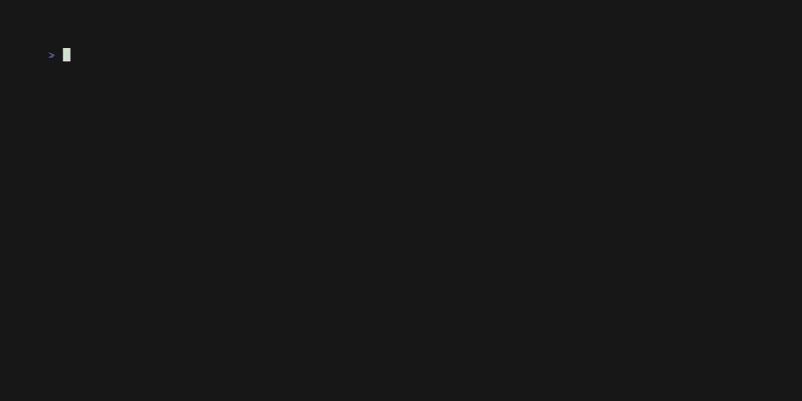

# voidmatrix ⚡

> The ultimate, high-performance Matrix-style digital rain animation simulator for your terminal — built in Go.

[](https://golang.org)
[](https://opensource.org/licenses/MIT)

`voidmatrix` is a modern, production-grade terminal digital rain simulator. Inspired by utilities like `cmatrix` and `unimatrix`, it pushes visual terminal animations to their absolute limits, introducing **3D parallax depth planes**, **smooth linear RGB blending**, **ground impact splashes**, **horizontal wind skew**, and **custom text decoder reveals**—all running on a **zero-allocation, event-driven rendering pipeline** locked to a steady 60 FPS.

---

## 🎬 Showcase



*Note: You can easily record your own high-fidelity GIF showcase using [VHS by Charm](https://github.com/charmbracelet/vhs) or [Asciinema](https://asciinema.org).*

---

## ✨ Key Features

*   **🌌 3D Parallax Depth Layers**: Rain is divided into Far (slow, dim, non-bold), Med (standard), and Near (fast, extra-bright, bold) layers. Foreground layers naturally overlap and pass background layers.
*   **🔐 Text Decoder Reveal**: Center custom message strings (using `-msg "TEXT"`) and watch them decrypt letter-by-letter as falling rain passes over them, glowing white-hot before locking into place.
*   **🌧️ Ground Impact Splashes**: Expanding particle splash ripples (`*` -> `+` -> `.`) trigger dynamically on the bottom row when rain streams hit the ground.
*   **🌪️ Wind Drift Skew**: Simulates horizontal wind skew forces (`--wind left/right`), adjusting column movement angles with perspective-correct speed shifts per depth layer.
*   **🌈 Linear RGB Blending**: Continuous linear interpolation blends stream colors smoothly from white-hot head leaders, through saturated neon tones, into fading dim tails that dissolve cleanly into the background.
*   **⚡ Transmission Glitches**: Random columns strobe white/pink and warp all characters for a single frame, simulating signal glitches.
*   **⚙️ Default Config File**: Automatically loads options from `~/.voidmatrix/config.yaml`.
*   **🚀 Zero-Allocation Render Loop**: Avoids heap allocation inside the active frame loop using double-buffered pre-allocated grids, resulting in **zero Garbage Collection micro-stutters** and minimal CPU usage.

---

## ⚙️ Preset Modes

`voidmatrix` includes four carefully calibrated visual presets to change terminal vibes instantly:

```bash
# ⚡ Hacker: neon, ultra-fast, glitchy, splashing terminal rain
./voidmatrix --mode hacker

# 🧘 Chill: slow, relaxing, soft-glow cyan waterfall rain (no bold)
./voidmatrix --mode chill

# 🌪️ Chaos: fast, skewed rainbow rain storm
./voidmatrix --mode chaos

# 🎬 Cinematic: slow, green, right-skewed clean rain (movie accurate)
./voidmatrix --mode cinematic
```

---

## 🚀 Installation & Build

### 1. Prerequisite
Ensure you have [Go](https://golang.org) (version 1.16+) installed.

### 2. One-Line Installer Script (macOS / Linux)
You can compile and install `voidmatrix` globally with a single command:
```bash
curl -sSL https://raw.githubusercontent.com/yourusername/voidmatrix/main/install.sh | sh
```

### 3. Manual Build (from source)
Clone the repository and build the binary:
```bash
go build -o voidmatrix .
```

### 3. Install to System Path
You can easily build and install `voidmatrix` globally using the included Makefile:
```bash
# Installs to /usr/local/bin by default (requires sudo)
sudo make install

# Install locally to a custom path (e.g., ~/.local/bin) without sudo:
make install PREFIX=$HOME/.local
```

### 4. Direct Go Installation
```bash
go install github.com/yourusername/voidmatrix@latest
```

### 5. Arch Linux (AUR)
If you are running Arch Linux (or an Arch-based distro), you can build and install natively using the included `PKGBUILD`:
```bash
makepkg -si
```
*(Once you submit it to the Arch User Repository, it will be installable via AUR helpers like `yay -S voidmatrix-git`).*

### 6. Windows Installation (PowerShell / CMD)
On Windows, `voidmatrix` runs natively inside Windows Terminal, PowerShell, or Command Prompt (CMD).
*   **Compile Executable**:
    ```powershell
    go build -o voidmatrix.exe .
    ```
*   **Launch**:
    ```powershell
    .\voidmatrix.exe
    ```
*   **Global Installation** (automatically compiles and places `voidmatrix.exe` inside your `%GOPATH%\bin` directory):
    ```powershell
    go install github.com/yourusername/voidmatrix@latest
    ```

### 7. Self-Updating (macOS / Linux / Windows)
You can update `voidmatrix` to the latest version directly from GitHub at any time by running:
```bash
voidmatrix update
```

---

## 🎮 Real-time Controls

While the animation is running, you can adjust settings instantly:

| Key | Action | Description |
| :--- | :--- | :--- |
| **`↑` / `w` / `W`** | Speed Up Fast | Increases speed by +3 steps |
| **`↓` / `s` / `S`** | Slow Down Fast | Decreases speed by -3 steps |
| **`→` / `+` / `=`** | Speed Up Slow | Increases speed by +1 step |
| **`←` / `-`** | Slow Down Slow | Decreases speed by -1 step |
| **`d` / `D`** | Density Up | Adds more rain streams |
| **`a` / `A`** | Density Down | Reduces number of rain streams |
| **`[`** | Toggle Async | Toggles independent stream speeds |
| **`f`** | Toggle Flashers | Toggles random glowing characters |
| **`b`** | Cycle Bold | Cycles between Mixed, All, and No Bold |
| **`c`** | Cycle Charset | Cycles through Katakana, Hiragana, Emojis, Cyrillic, Greek, Numbers, and ASCII presets |
| **`1` - `9`** | Color Theme | Selects color themes (Green, Red, Blue, White, Rainbow, Purple, Cyan, Amber, Gold) |
| **`o`** | Toggle OSD | Shows/hides the centered metrics HUD overlay |
| **`Space` / `q` / `Q`** | Quit | Restores terminal settings and exits safely |

---

## 📋 Configuration File

`voidmatrix` natively loads defaults from a local configuration file.
*   **Unix-like path**: `~/.voidmatrix/config.yaml`
*   **Windows path**: `C:\Users\<YourUsername>\.voidmatrix\config.yaml`

Example configuration:

```yaml
# ~/.voidmatrix/config.yaml
speed: 0.45
density: 0.72
theme: green
glitch: false
wind: none
splash: false
```

*Precedence Hierarchy: Defaults ➔ Config File ➔ Preset Mode ➔ Explicit CLI Flags (overrides everything).*

---

## 📊 Live Performance HUD (`--debug` / `-d`)

To verify the performance characteristics and resource footprint of `voidmatrix` in real-time, run with the `--debug` flag:

```bash
./voidmatrix --debug
```

This draws a small performance HUD in the bottom-right corner showing:
- **FPS**: Real-time rolling average of the frame rate (locked to a smooth 60 FPS).
- **Render Latency**: Exact frame draw duration in microseconds (typically under 100-300µs).
- **Heap Allocation**: Live memory usage in Megabytes (stays flat, proving zero per-frame heap allocations!).
- **GCs**: Accumulated Garbage Collector cycle count.

---

## 📄 License

This project is licensed under the MIT License - see the LICENSE file for details.
