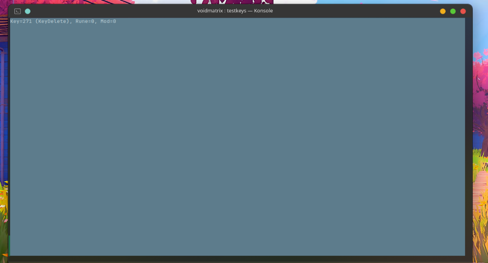

```
       _     _                 _   _       
__  __(_) __| |_ __  __ _ _  _| |_| |_ __ __ __
\ \/ /| |/ _` | '  \/ _` | || |  _|  _|\ \ /   /
 \__/ |_|\__,_|_|_|_\__,_|\_,_|\__|\__|/_\_\\_/ 
```

> **Matrix digital rain for terminal enthusiasts.** Heavy on aesthetics, light on resources.

`voidmatrix` is a lightweight, cross-platform terminal animation that brings the classic Matrix digital rain into the modern terminal. It is built in Go with a zero-allocation, rate-limited render loop for buttery-smooth 60 FPS performance without garbage collection stutters.

---

## 🎬 Showcase



---

## 🌌 Core Features

*   **3D Parallax Depth**: falling streams are split across Far, Med, and Near planes with independent speeds, colors, and overlap physics.
*   **Decoder Reveal**: Center any text (e.g. `-msg "HELLO"`) and watch it decode character-by-character as rain sweeps over it.
*   **Weather Dynamics**: Wind drift skew (`--wind left/right`) and ground particle splashes (`-splash`).
*   **Glitch strobes**: Random frames warp columns and color schemes for a true glitchy transmission feel.
*   **Zero Alloc Loop**: Pre-allocated buffers, double-buffered state pools, and an inline Xorshift32 PRNG. Zero heap churn during animation.

---

## 🚀 Quick Start

### Install instantly (macOS / Linux)
```bash
curl -sSL https://raw.githubusercontent.com/abdulrahman-sec/voidmatrix/main/install.sh | sh
```

### Install natively on Arch Linux
```bash
git clone https://github.com/abdulrahman-sec/voidmatrix.git
cd voidmatrix && makepkg -si
```

### Install with Go
```bash
go install github.com/abdulrahman-sec/voidmatrix@latest
```

### Manual compile
```bash
go build -o voidmatrix .
```

### Windows (PowerShell)
```powershell
go build -o voidmatrix.exe .
.\voidmatrix.exe
```

---

## 🕹️ Interactive Controls

Modify the simulation in real-time while it runs:

*   `W` / `S` — Increase / Decrease speed
*   `D` / `A` — Increase / Decrease density
*   `[` — Toggle independent stream speeds (async mode)
*   `F` — Toggle glowing flashers
*   `B` — Cycle character thickness (bold style)
*   `C` — Cycle character sets (Katakana, Hiragana, Cyrillic, Emojis, Numbers, Symbols, ASCII)
*   `1` to `9` — Switch color schemes (Green, Red, Blue, White, Rainbow, Purple, Cyan, Amber, Gold)
*   `O` — Hide/Show status overlay
*   `Space` / `Q` — Exit immediately

---

## ⚡ Visual Presets (`--mode`)

Change vibes instantly with calibrated combinations:

```bash
voidmatrix --mode hacker      # Fast, dense, splashing, and glitchy rain
voidmatrix --mode chill       # Slow, dim, cyan waterfall rain (no bold)
voidmatrix --mode chaos       # Rainbow storm with heavy left-hand wind skew
voidmatrix --mode cinematic   # Movie-accurate slow green rain with light drift
```

---

## 📋 Configuration File

Config file defaults are loaded automatically from:
*   **Unix**: `~/.voidmatrix/config.yaml`
*   **Windows**: `%USERPROFILE%\.voidmatrix\config.yaml`

Example:
```yaml
speed: 0.45
density: 0.72
theme: green
glitch: false
wind: none
splash: false
```

---

## 📊 Live Metrics (`--debug`)

Run with `--debug` to open the performance dashboard in the bottom-right corner:
```bash
voidmatrix --debug
```
*Displays rolling FPS (60 FPS locked), frame draw latency in microseconds, live Go heap usage, and cumulative GC cycle count.*

---

## 📄 License

MIT. See [LICENSE](LICENSE) for details.
